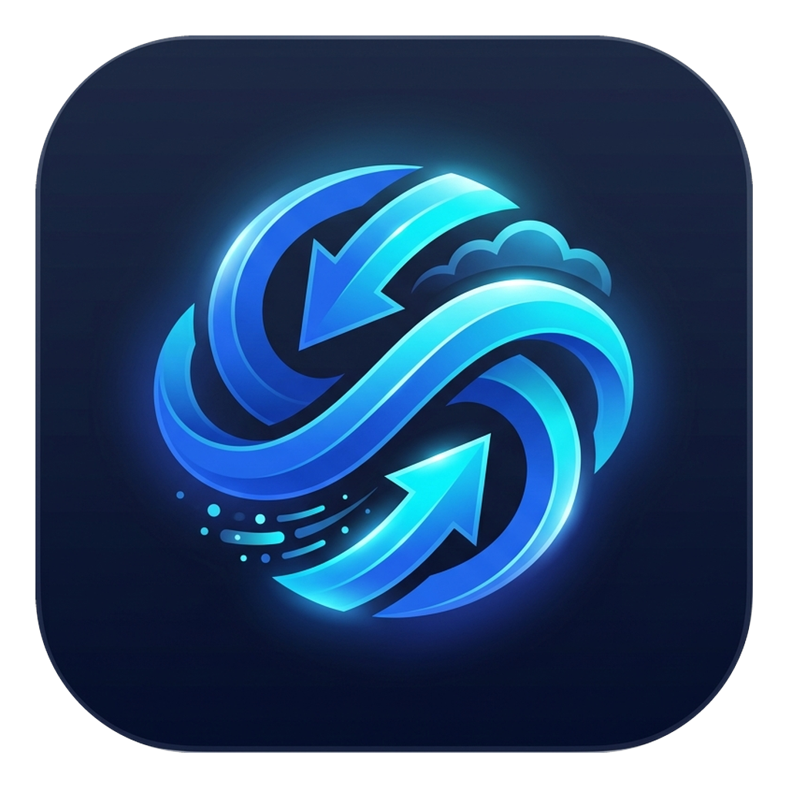

# 🚀 EasyShare PRO | שיתוף קל

<p align="center">
  
</p>

<p align="center">
  <strong>Enterprise File Sharing & Cloud Streaming Suite for Windows</strong><br>
  <em>פלטפורמת שיתוף קבצים, הזרמת מדיה ומנהור ענן מתקדמת למחשב</em>
</p>

<p align="center">
  <a href="https://github.com/ELISTE770/EasyShare/releases/latest"></a>
  
  
  
  <a href="https://smartbinary.org"></a>
</p>

---

## 🌟 סקירה כללית (Overview)

**EasyShare PRO** היא אפליקציית שולחן עבודה מודרנית ויוקרתית ל-Windows, המאפשרת שיתוף קבצים מיידי, הזרמת מדיה (וידאו ואודיו) ברשת המקומית ובאינטרנט העולמי, ללא צורך בהגדרות ראוטר מסובכות או פתיחת פורטים ידנית.

התוכנה פועלת באופן מלא במצב משתמש רגיל (Standard User) ללא צורך בהרשאות מנהל מערכת (No UAC / No Admin Required).

---

## ✨ תכונות עיקריות (Key Features)

- 🌐 **שיתוף ברשת המקומית (LAN / Wi-Fi)**: שרת HTTP פנימי עתיר ביצועים התומך ב-HTTP 206 Partial Content (Seek מהיר בווידאו ושירים).
- ☁️ **מנהור ענן מיידי (Cloudflare Tunnels)**: שיתוף מאובטח דרך קישור HTTPS עולמי אקראי או דומיין אישי קבוע (Custom Domain).
- 🔒 **אימות ואבטחה מבוססת PIN**: הגנה מפני גישה לא מורשית עם קוד PIN בן 8 ספרות ומנגנון הגנת Brute-Force מובנה.
- 🎯 **אינטגרציה מלאה בסייר הקבצים (Windows Explorer)**: תפריט קליק ימני על קבצים ותיקיות לשיתוף מיידי והעתקת קישור אוטומטית ללוח.
- 📥 **ווידג'ט צף שולחני (Floating Drop-Zone)**: שחרור קבצים קל מכל מקום בשולחן העבודה.
- ⚡ **קיצור מקשים גלובלי (Alt+S)**: שיתוף מהיר של קבצים מתוך סייר הקבצים בלחיצת מקש אחת.
- 👥 **איתור עמיתים ו-Direct Drop**: גילוי מחשבים ומכשירים ברשת המקומית ובאינטרנט (MQTT Beacon) והעברת קבצים וצ'אט ישיר ביניהם.
- 🔄 **בדיקת עדכונים אוטומטית מ-GitHub**: התראה בזמן אמת על גרסאות חדשות עם קישור מהיר להתקנה.
- 🎨 **ממשק Obsidian מרהיב דו-לשוני**: תמיכה מלאה בעברית (RTL) ובאנגלית (LTR), כולל מצב כהה וסנכרון עם ערכת הנושא של Windows.

---

## 📦 הורדה והתקנה (Download & Installation)

הורד את קובץ ההתקנה העדכני ביותר מתוך [דף השחרורים ב-GitHub (Releases)](https://github.com/ELISTE770/EasyShare/releases/latest):

1. הורד את `EasySharePRO_Setup_v2.5.0.exe`.
2. הפעל את ההתקנה (ההתקנה מתבצעת ישירות ללא דרישת הרשאות מנהל).
3. פתח את **EasyShare PRO** משולחן העבודה או מתפריט ההתחלה, או לחץ מקש ימני על כל קובץ ובחר **שתף באמצעות EasyShare PRO**.

---

## 🛠️ דרישות מערכת (System Requirements)

- **מערכת הפעלה**: Windows 10 (Build 19041 ומעלה) / Windows 11.
- **ארכיטקטורה**: x64 (64-bit).
- **סביבת ריצה**: .NET 9.0 Desktop Runtime.

---

## 🏗️ בנייה מקוד מקור (Building from Source)

```bash
# שכפול המאגר
git clone https://github.com/ELISTE770/EasyShare.git
cd EasyShare

# הרצת בדיקות מערכת מקיפות
dotnet run -- --test

# הידור והפצה
dotnet publish EasyShare.csproj -c Release -r win-x64 --self-contained false -o publish_inno

# קימפול חבילת ההתקנה (Inno Setup)
& "C:\Users\Eli\AppData\Local\Programs\Inno Setup 6\ISCC.exe" EasyShareSetup.iss
```

---

## 🛡️ אבטחה ופרטיות (Security & Privacy)

- **שליטה מוחלטת**: הקבצים נשארים במחשב שלך ואינם מאוחסנים באף שרת צד-שלישי.
- **השמדת קישורים בטוחה**: השמדת קישור שיתוף מבטלת את הגישה מרחוק בלבד — הקובץ המקורי במחשב נשמר בבטחה ולעולם אינו נמחק.
- **סל מחזור**: קבצים שנמחקים דרך ממשק ה-Web מועברים לסל המחזור של Windows ולא נמחקים לצמיתות (ניתן להגדרה).

---

## 🏷️ קרדיטים וחתימה (Credits)

- **עברית**: נבנה על ידי [בינארי חכם](https://ivrit.smartbinary.org)
- **English**: Built by [Smart Binary](https://smartbinary.org)
